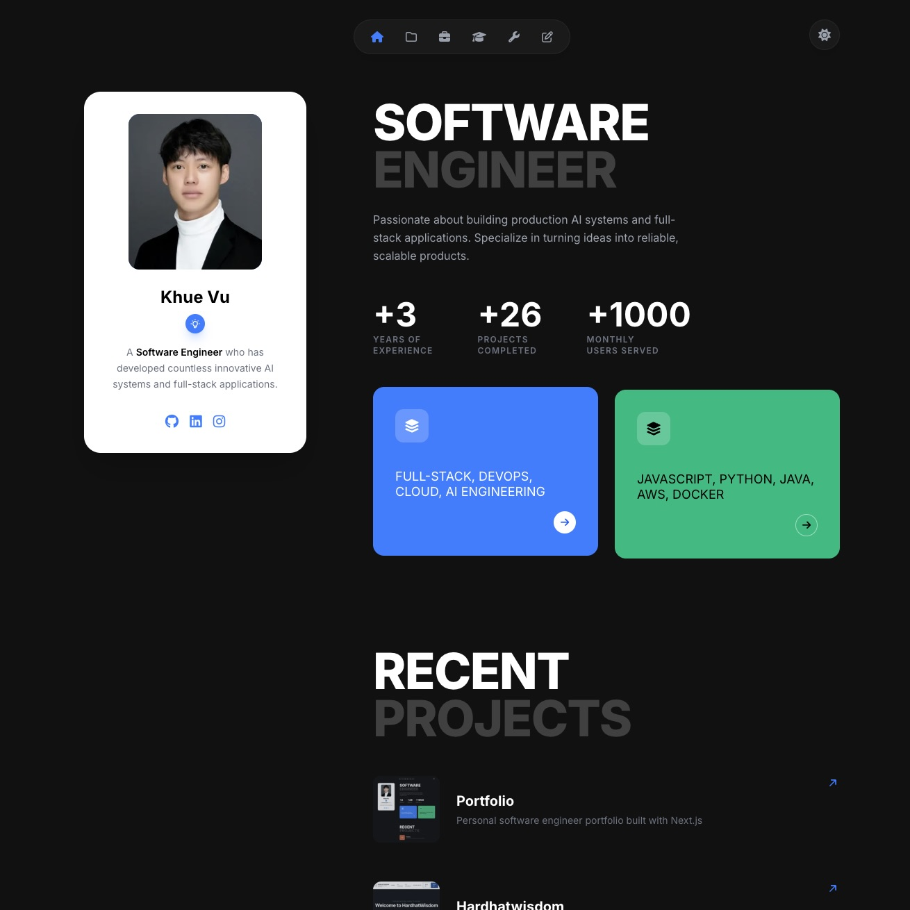

# Khue Vu - Software Engineer Portfolio



A modern, responsive portfolio website showcasing my work as a Software Engineer specializing in building production AI systems and full-stack applications. This portfolio is deployed through Vercel and is live at: [vivukhue.vercel.app](https://vivukhue.vercel.app)

## About Me

I'm Khue Vu, a passionate Software Engineer with 3+ years of experience who has developed countless innovative AI systems and full-stack applications. I specialize in turning ideas into reliable, scalable products.

**Key Achievements:**
- 3+ Years of Experience
- 26+ Projects Completed
- 1000+ Monthly Users Served

## Features

- **Modern Design**: Clean, responsive interface with smooth animations using Motion
- **Multiple Sections**: Hero, Projects, Experience, Education, Tools, and Contact
- **Interactive Navigation**: Sidebar and top navigation with smooth scrolling
- **Dark/Light Theme**: Built-in theme toggle for personalized viewing experience
- **Contact Form**: Functional contact form with email integration via Resend
- **Project Showcase**: Detailed project displays with images and descriptions
- **Performance Optimized**: Built with Next.js 16 and React 19 for optimal performance

## Tech Stack

- **Framework**: Next.js 16.3.4 (App Router)
- **UI Library**: React 19.2.8
- **Styling**: Tailwind CSS 4
- **Animations**: Motion 13.1.1
- **Email Service**: Resend 6.26.0
- **Validation**: Zod 4.5.4
- **Language**: TypeScript 5

## Project Structure

```
vivukhue-portfolio/
├── app/
│   ├── (site)/          # Main site pages
│   │   ├── contact/     # Contact page
│   │   ├── education/   # Education page
│   │   ├── experience/  # Experience page
│   │   ├── projects/    # Projects page
│   │   └── tools/       # Tools page
│   ├── actions/         # Server actions
│   └── layout.tsx       # Root layout
├── components/
│   ├── layout/          # Layout components (Sidebar, Footer, etc.)
│   ├── sections/        # Page sections (Hero, Projects, etc.)
│   └── ui/              # Reusable UI components
├── data/                # Static data (profile, projects, skills)
└── public/              # Static assets (images, icons)
```

## Getting Started

First, install dependencies:

```bash
npm install
# or
yarn install
# or
pnpm install
```

Then, run the development server:

```bash
npm run dev
# or
yarn dev
# or
pnpm dev
# or
bun dev
```

Open [http://localhost:3000](http://localhost:3000) with your browser to see the result.

## Environment Variables

Create a `.env` file in the root directory and add the following:

```env
RESEND_API_KEY=your_resend_api_key_here
```

## Available Scripts

- `npm run dev` - Start development server
- `npm run build` - Build for production
- `npm run start` - Start production server
- `npm run lint` - Run ESLint

## Connect With Me

- [GitHub](https://github.com/kvv190001)
- [LinkedIn](https://linkedin.com/in/steven-vu-swe)
- [Instagram](https://instagram.com/vivukhue)
